<div align="center">

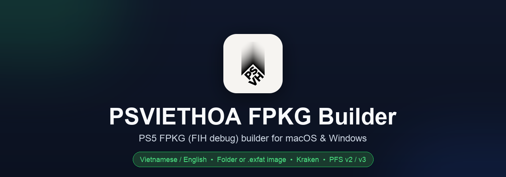

🇻🇳 Tiếng Việt: [docs/README.vi.md](docs/README.vi.md)

**Build PS5 FPKG (FIH debug) packages from an app folder, an `.exfat` disk image or a GP5 project — and extract existing packages — on macOS and Windows.**

Bilingual UI (Vietnamese / English) · Speed presets · PFS v2 / v3 · GP5 projects · Package extraction · Free‑space & junk checks · ETA & throughput · Built‑in verification · CLI

<a href="https://github.com/thanhsondev/PSVIETHOA-FPKG-Builder/releases/latest"></a>


</div>

<p align="center">
  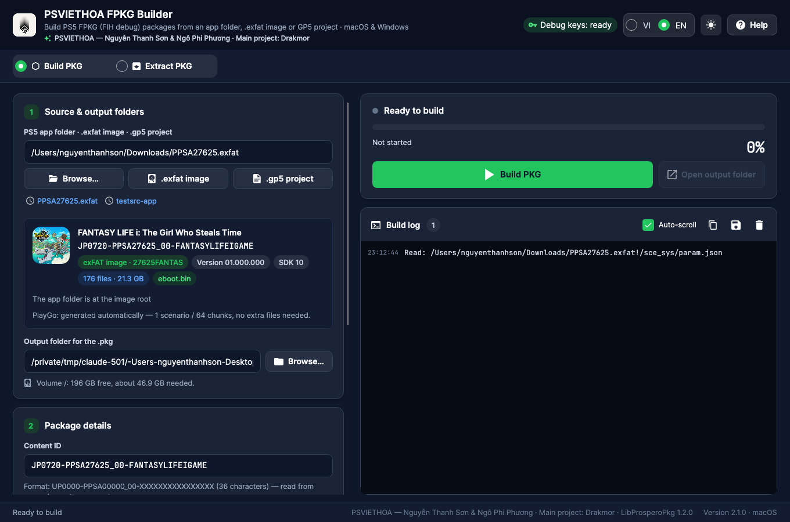
  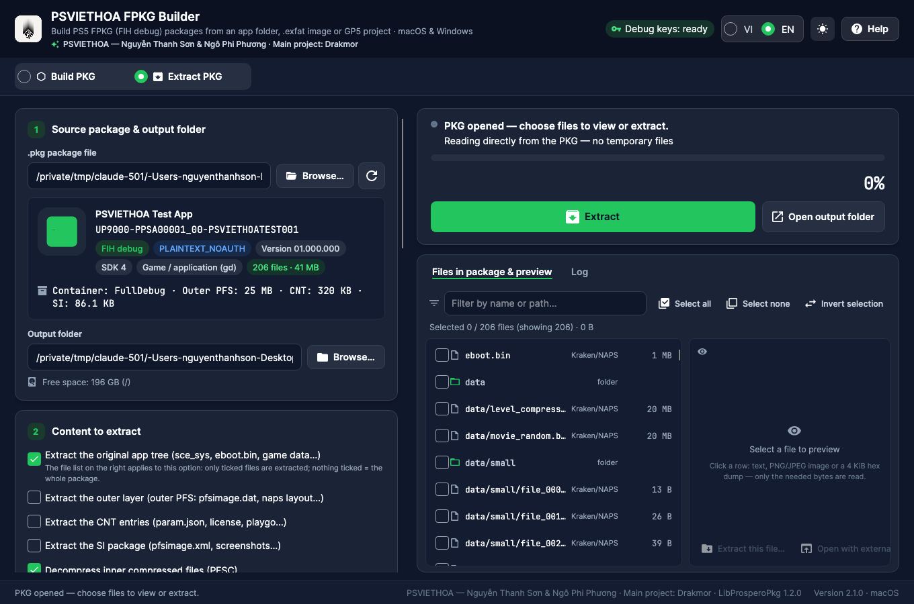
  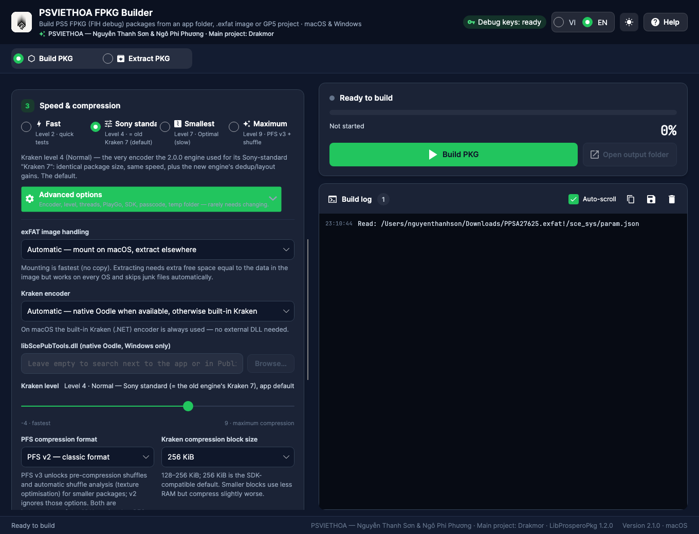
</p>

<div align="center">

**Credits:** PSVIETHOA — Nguyễn Thanh Sơn & Ngô Phi Phương · **Main project:** [Drakmor](https://github.com/) (LibProsperoPkg)

</div>

---

## Why?

Existing FPKG tooling for PS5 (`LibProsperoPkg.Gui`) is **Windows‑only WPF**. PSVIETHOA FPKG Builder is a full rewrite in **C# / .NET 10 + Avalonia UI** that runs natively on **macOS (Apple Silicon & Intel) and Windows**, adds a **bilingual interface**, accepts **`.exfat` disk images** as a source, and focuses on being **smooth and fast when building very large game folders** (tens of GB). The package engine is **LibProsperoPkg** by **Drakmor** (the September 2026 build shipped with fpkg‑gui 0.6.2), so the packages it produces are byte‑for‑byte correct.

> The result is a **debug FPKG** (FIH image, signed byte `0x00`) — it installs only on a **PS5 with debug mode enabled**.

## What's new in 2.1.0

- **Updated LibProsperoPkg engine** — overlapping reads / compression / writes with fewer intermediate copies, block deduplication and an in‑build compression cache, improved built‑in Kraken (especially levels 8–9), automatic fallback to built‑in Kraken when Oodle is unavailable, file‑handling and cancellation fixes, and existing packages are preserved if a rebuild fails.
- **PFS v2 / v3 selection**, configurable **Kraken block size** (128–256 KiB), **pre‑compression shuffle patterns** and **automatic shuffle analysis** (PFS v3 texture optimisation through permutation selection — very slow, fully effective only at Kraken level 9), optional **physical layout optimisation**. PFS v3 packages need **PS5 firmware 7.00 or newer**; the app warns about it.
- **Presets re‑mapped to the new encoder**: the default is now **Sony standard** = Kraken 4, the very encoder the 2.0.0 engine used for its "Kraken 7" (same size, same speed, plus dedup/layout gains); **Smallest** = Kraken 7 *Optimal* is a new deeper mode (~3 % smaller, 5–6× slower); new **Maximum** preset (Kraken 9 + PFS v3 + shuffle analysis).
- Live **throughput** in the build panel, smoother progress on multi‑GB files, re‑tuned ETA.
- CLI: `--pfs`, `--block-size`, `--shuffle`, `--shuffle-analysis`, `--shuffle-prediction-level`, `--skip-pfs-input-check`, `--no-layout-optimization`, `--source-mode`, `--project`, `--preset sony|standard`; new `pkg-info`, `pkg-list`, `pkg-extract` commands.
- **Extract packages** — new **Extract PKG** mode (Build | Extract bar under the header): open a `.pkg` (or drop it onto the window) to see the FIH / CNT headers, every `param.json` field, the icon and the full file list of the inner PPR‑PFS image; tick files or folders and extract them (or the whole package), or export the `sce_sys` entries. PLAINTEXT_NOAUTH packages are read straight from the `.pkg` in 4 MiB chunks without rebuilding the image; Native (AES‑XTS) packages are decrypted to the temp folder first. CLI: `pkg-info`, `pkg-list`, `pkg-extract`.
- **GP5 project sources** (`.gp5`, like fpkg‑gui's Folder | GP5 selector): pick a Publishing Tools / fpkg‑gui project in step 1 or drop it onto the window — Normal and Flat layouts, exclude masks and relative paths are honoured, the passcode comes from the project; `fpkg-cli inspect` / `build --source x.gp5`; an advanced **Source reading mode** chooses between an automatic top‑level `.gp5` and folder‑only packaging.

See [CHANGELOG.md](CHANGELOG.md) for details.

## Features

| Area | Details |
|---|---|
| **Sources** | An app folder (containing `sce_sys`) **or an exFAT disk image (`.exfat`)** — bare volume, MBR, or GPT. A pure‑.NET exFAT reader reads `param.json` / icon / size straight from the image. On macOS the image is **mounted read‑only via `hdiutil` (no copy)**; on Windows, or when the image contains junk files, it is **extracted to the temp folder** (skipping `.DS_Store`, `._*`, `Thumbs.db`…) and cleaned up afterwards. **Or a GP5 project (`.gp5`)** from Publishing Tools / fpkg‑gui — Normal layout (`rootdir` + exclude masks) or Flat layout (explicit file list); relative paths resolve from the project's folder, the metadata card shows the layout and project root, and only the files the project lists are counted. |
| **Languages** | Vietnamese / English, switch instantly in the header, choice is remembered. CLI takes `--lang vi\|en` or the `FPKG_LANG` variable. |
| **Packaging** | FIH debug image, PLAINTEXT_NOAUTH or Native AES‑XTS, APP / Homebrew / DLC, automatic PlayGo (1–64 chunks), SDK override (1–11), passcode, deterministic builds. |
| **Compression** | Built‑in **managed Kraken encoder** (runs everywhere, multi‑threaded) or **native Oodle** via `libScePubTools.dll` (Windows, automatic fallback to built‑in Kraken). **PFS v2** (default, broadest compatibility) or **PFS v3** (pre‑compression shuffle patterns, automatic per‑block shuffle analysis), Kraken block size 128–256 KiB, physical layout optimisation. |
| **Speed** | Presets **Fast · Sony standard · Smallest · Maximum**. **Sony standard** (default) = Kraken level 4, the very encoder the 2.0.0 engine used for its "Kraken 7": same size, same speed. **Smallest** = Kraken 7 *Optimal* — a new deep-compression mode, about 3 % smaller but 5–6× slower. **Maximum** = Kraken 9 + PFS v3 + shuffle analysis. Custom level `-4…9`, thread count, and an uncompressed mode for quick tests. |
| **Before building** | Reads metadata + icon, scans size in parallel, **checks free space** on the temp/output volumes, and **detects & cleans OS junk files**. |
| **While building** | Weighted overall progress bar with **ETA** and live **throughput**, byte‑weighted progress inside multi‑GB files, virtualized 20k‑line log, safe cancel, and **sleep prevention** (`caffeinate` / `SetThreadExecutionState`). |
| **After building** | Verifies the FIH / outer‑PFS structure, optional SHA‑256, result panel, copy/save the log, open the output folder. |
| **Extract packages** | **Extract PKG** mode: FIH / CNT headers, region map, every `param.json` field, icon and file list of a debug FPKG; filter and tick files/folders, extract a selection or everything with progress and cancel, export `sce_sys` (param.json, icon0.png, playgo…) and SI entries, optional SHA‑256. Plaintext packages are read in place (4 MiB chunk cache, no temp image); Native packages are decrypted to the temp folder first; retail packages are information‑only. |
| **CLI** | `fpkg-cli build / inspect / verify / clean-junk / info / pkg-info / pkg-list / pkg-extract` for batch builds, scripting, and CI. |

## Download & run

Grab the archive for your platform from the [**Releases**](https://github.com/thanhsondev/PSVIETHOA-FPKG-Builder/releases/latest) page. Each build is **self‑contained** — no .NET install required.

- **macOS** — unzip, then right‑click `PSVIETHOA FPKG Builder.app` → **Open** the first time (the app is ad‑hoc signed).
- **Windows** — unzip and run `PSVIETHOA FPKG Builder.exe`. SmartScreen may prompt → **Run anyway**.

Each archive also contains the `fpkg-cli` command‑line tool.

## Quick start

1. Prepare an extracted PS5 app folder (with a `sce_sys` folder and `eboot.bin`), **or** point at a `.exfat` disk image.
2. In **step 1**, click **Browse…** / **.exfat image**, or drop the folder/image onto the window. Content ID, title, version, size, and junk files are detected automatically.
3. Pick a speed preset in **step 3** (Sony standard is the default and equals the old engine's "Kraken 7"; Smallest = level 7 Optimal, slow) or open the advanced options.
4. Click **Build PKG** (`Ctrl/⌘+B` or `F5`). Watch the progress, ETA, and log; the structure is verified automatically when it finishes.

## Command line

```bash
fpkg-cli info --lang en
fpkg-cli inspect "/path/PPSA12345"                 # folder
fpkg-cli inspect "/path/PPSA12345.exfat"           # exFAT image — read directly, no mount
fpkg-cli build --source "/path/PPSA12345.exfat" --output "/path/out"           # default: Sony standard (level 4), exfat auto
fpkg-cli build --source "/path/PPSA12345.exfat" --output "/path/out" --exfat extract
fpkg-cli build --source "/path/PPSA12345" --output "/path/out" --preset fast --clean-junk
fpkg-cli build --source "/path/PPSA12345" --output "/path/out" --preset maximum       # Kraken 9 + PFS v3 + shuffle analysis
fpkg-cli build --source "/path/PPSA12345" --output "/path/out" --pfs v3 --shuffle PredictForBc3 --block-size 128
fpkg-cli verify "/path/out/UP9000-PPSA12345_00-XXXX-A0100-V0100.pkg" --sha256
fpkg-cli pkg-info "/path/out/UP9000-PPSA12345_00-XXXX-A0100-V0100.pkg"                # General + param.json
fpkg-cli pkg-list "/path/out/UP9000-PPSA12345_00-XXXX-A0100-V0100.pkg" --include "*.sprx"
fpkg-cli pkg-extract "/path/out/UP9000-PPSA12345_00-XXXX-A0100-V0100.pkg" --output "/path/unpacked" --include "sce_sys/**" --include "eboot.bin" --cnt
```

Exit codes: `0` success · `1` invalid arguments · `2` build failed · `3` cancelled.

## exFAT images (.exfat)

- Detected automatically by the `EXFAT   ` signature at the volume start, or inside an MBR/GPT partition; common offsets (sector 63, 2048…) are probed too.
- The app folder is located up to 3 levels deep inside the image (root first, e.g. dumps with `sce_sys` at the root).
- **macOS:** `hdiutil attach -readonly -imagekey diskimage-class=CRawDiskImage` → build straight from the mount point, unmount when done. *Automatic* only mounts a clean image; if junk files are present it extracts so they can be skipped.
- **Windows / Linux:** extracted with the pure‑.NET reader (3 workers, 4 MB buffers) to `<temp>/exfat-<name>-<hash>/`, needing extra free space ≈ the data in the image; removed after the build (even on cancel).
- **Validated:** the same image built two ways — hdiutil mount vs. pure‑.NET extraction — produces **byte‑identical** packages (same SHA‑256), i.e. the reader matches the macOS driver exactly.

## Performance

Measured on an Apple‑Silicon Mac (15 logical cores), built‑in Kraken, LibProsperoPkg build shipped with 2.1.0:

| Test | Config | Time | Package |
|---|---|---|---|
| 400 MB synthetic | Fast (Kraken 2) / **Sony standard (4, default)** | 6.8 s / 7.5 s | 254.3 MB / 254.2 MB |
| 400 MB synthetic | Smallest (Kraken 7) | 16.4 s | 250.3 MB |
| 400 MB synthetic | Maximum (Kraken 9 + PFS v3 + shuffle analysis) | 47.6 s | 249.8 MB |
| 813 MB real game (`PPSA06438`, mounted .exfat) | Smallest / Fast | 23.4 s / 4.9 s | 257.2 MB / 262.8 MB |
| **21.3 GB real game** (`PPSA27625`, mounted .exfat) | Fast (Kraken 2) | 1 min 59 s | 8.86 GiB |
| **21.3 GB real game** | **Sony standard (Kraken 4, default)** | **2 min 13 s** | **8.86 GiB** |
| **21.3 GB real game** | Smallest (Kraken 7 Optimal) | 12 min 49 s | 8.54 GiB |

For comparison, the LibProsperoPkg build shipped with 2.0.0 built the same 21.3 GB game in 3 min 40 s to a 9.03 GiB package. Measured side by side on the same 400 MB set, the 2.0.0 engine produced **identical** packages at levels 4 and 7 (254,212,194 bytes) — its "level 7" was the Normal encoder — and the 2.1.0 engine at level 4 reproduces that result (254,211,794 bytes) at the same speed. So **Sony standard** (the default) gives you the old "Kraken 7" size at the old speed, and on the 21 GB game it is even faster and smaller than before (2 min 13 s, 8.86 GiB). **Smallest** is a genuinely new *Optimal* mode: another 3.5 % (8.54 GiB) for a 5–6× longer build on already‑compressed game data. Levels 4–6 produce identical output; level 7 and up switch to the optimal parser.

## Build from source

Requires the [.NET SDK 10](https://dotnet.microsoft.com/download) (`brew install dotnet` on macOS).

```bash
dotnet build PsViethoa.FpkgBuilder.slnx -c Release   # build everything
scripts/run-dev.sh                                   # run the GUI (macOS/Linux)
dotnet test                                          # run the test suite

scripts/publish-macos.sh osx-arm64 osx-x64           # dist/: .app + fpkg-cli + zip
scripts/publish-windows.sh                           # dist/win-x64: .exe + fpkg-cli + zip
```

<details>
<summary>Project layout</summary>

```
PsViethoa.FpkgBuilder.slnx
Directory.Build.props                 # net10.0, version (2.1.0), GC/PGO
CHANGELOG.md
libs/                                 # LibProsperoPkg.dll, libScePubTools.dll (Windows)
src/
  PsViethoa.FpkgBuilder.Core/         # engine, validation, exFAT reader, progress, localization
  PsViethoa.FpkgBuilder.App/          # Avalonia UI (MVVM), tokens/styles, views, assets
  PsViethoa.FpkgBuilder.Cli/          # fpkg-cli
tests/PsViethoa.FpkgBuilder.Tests/    # xUnit (68 tests)
scripts/                              # publish + dev scripts
```
</details>

## Screenshots

| Light theme | PFS v3 options | Vietnamese UI |
|---|---|---|
| 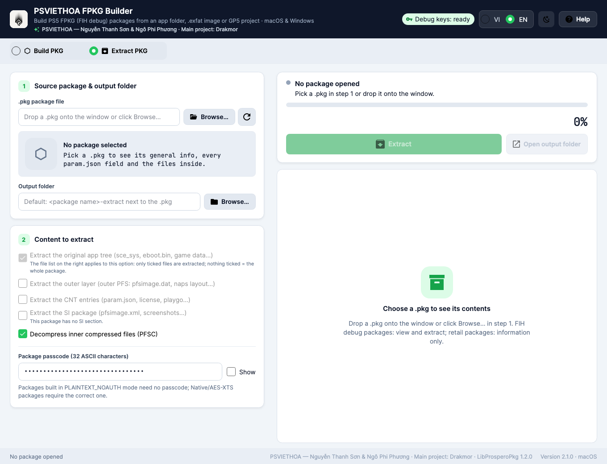 | 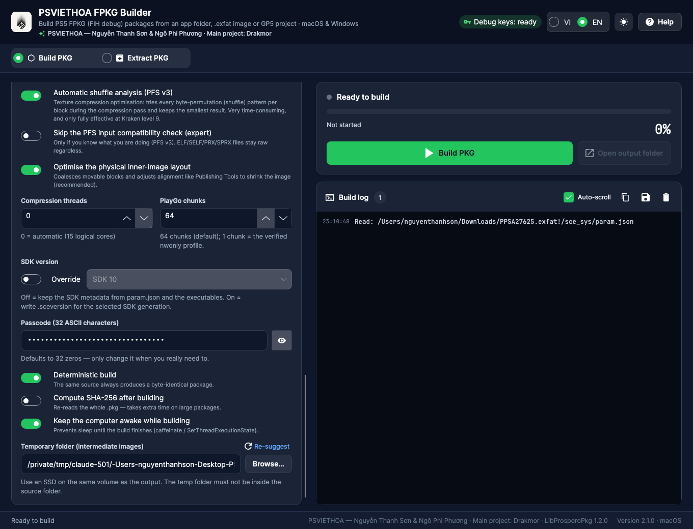 | 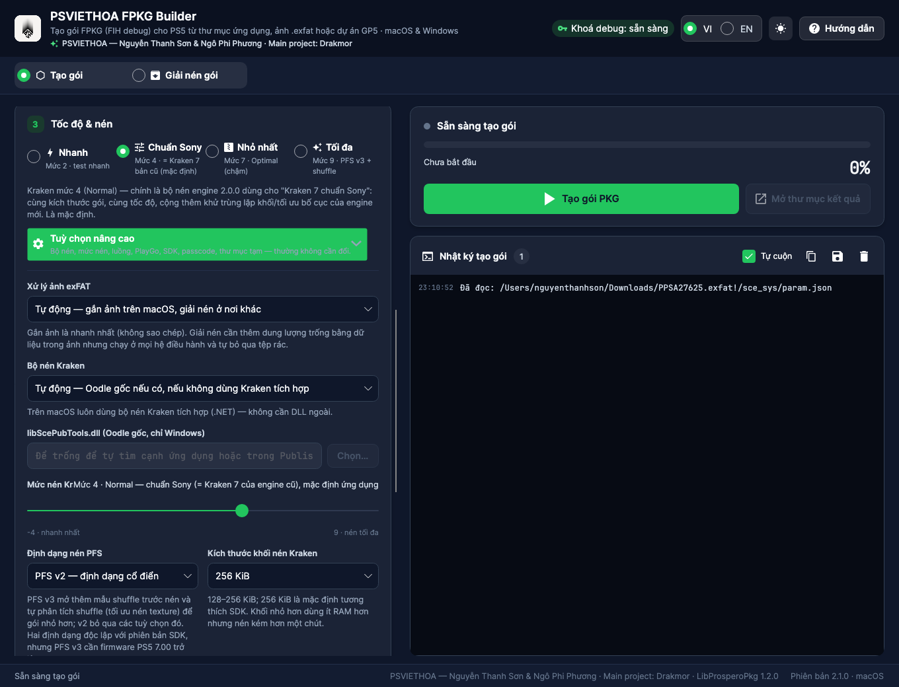 |

| While building | Extract mode (Vietnamese) | Extraction finished |
|---|---|---|
| 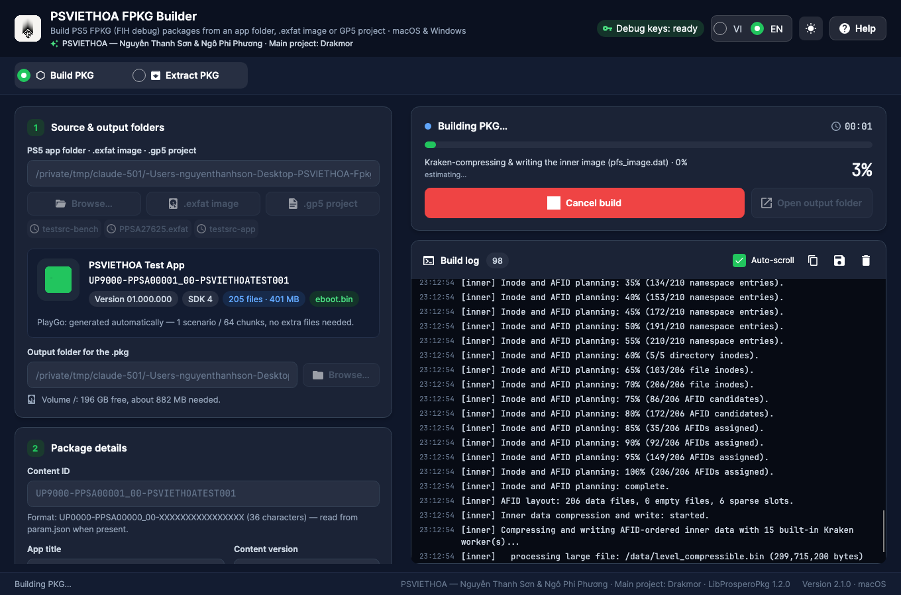 | 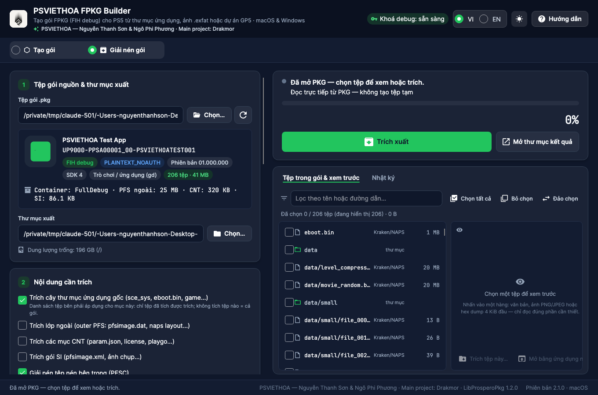 | 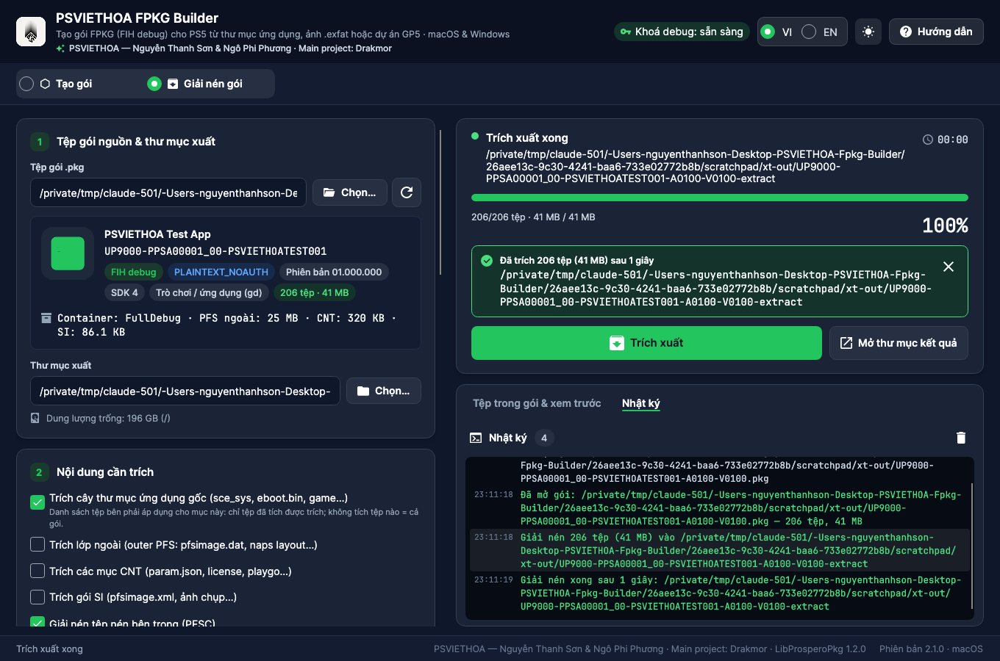 |

| Extract mode, light theme | Help — Credits |
|---|---|
| 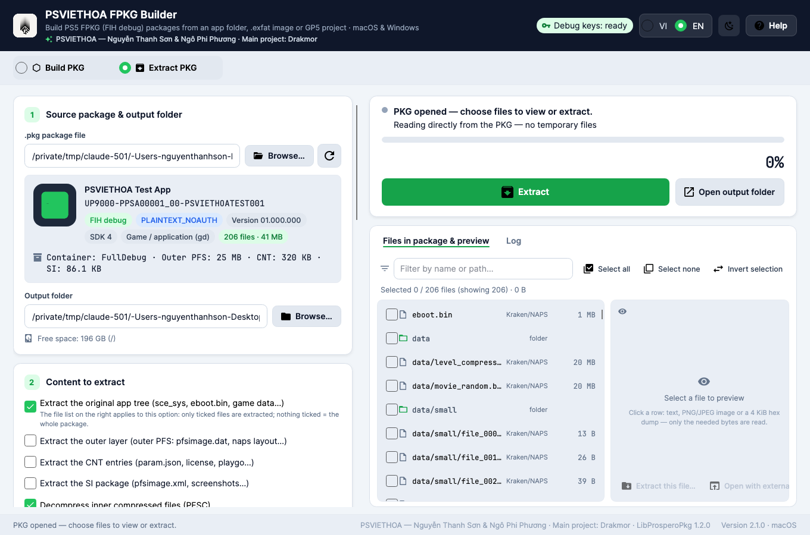 | 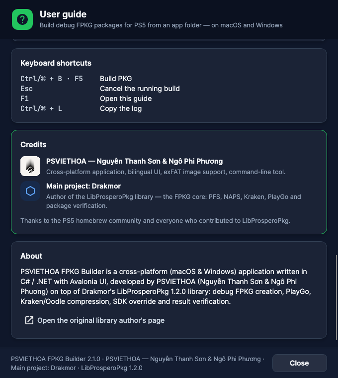 |

## Credits & license

- **PSVIETHOA — Nguyễn Thanh Sơn & Ngô Phi Phương** — cross‑platform application, bilingual UI, exFAT image support, `fpkg-cli`.
- **Main project: [Drakmor](https://github.com/)** — author of **LibProsperoPkg**, the FPKG core (PFS v2/v3, NAPS, Kraken, shuffle analysis, PlayGo, package verification).
- Fonts: JetBrains Mono & Inter (SIL OFL). Icons: Material Design Icons (Apache 2.0).
- Thanks to the PS5 homebrew community and everyone who contributed to LibProsperoPkg.

> This tool builds **debug** packages for homebrew and development on debug‑enabled consoles. It ships the third‑party `LibProsperoPkg.dll` / `libScePubTools.dll` unmodified. Use responsibly.

<div align="center">

Made with care by **PSVIETHOA** · 🇻🇳

</div>
