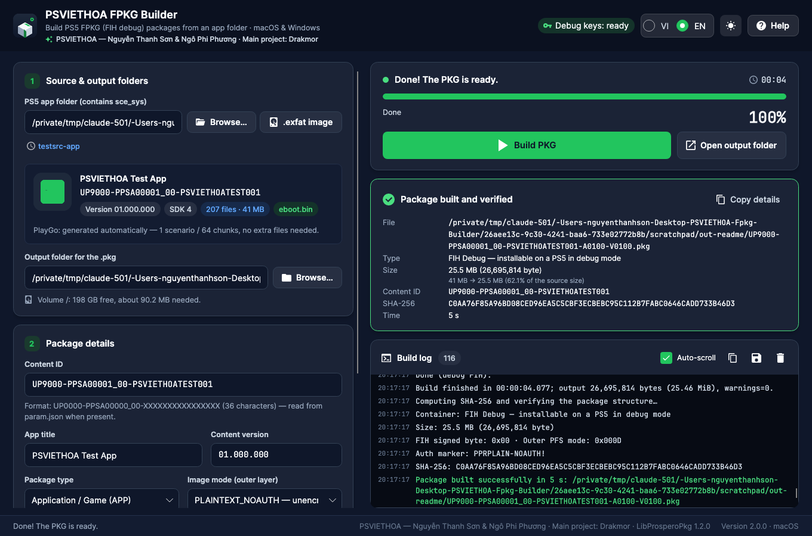

<div align="center">


**Build PS5 FPKG (FIH debug) packages from an app folder — or straight from an `.exfat` disk image — on macOS and Windows.**

Bilingual UI (Vietnamese / English) · Speed presets · Free‑space & junk checks · ETA · Built‑in verification · CLI

<a href="https://github.com/thanhsondev/PSVIETHOA-FPKG-Builder/releases/latest"></a>


</div>

<p align="center">
  
  
  
</p>

<div align="center">

**Credits:** PSVIETHOA — Nguyễn Thanh Sơn & Ngô Phi Phương · **Main project:** [Drakmor](https://github.com/) (LibProsperoPkg)

</div>

---

## Why?

Existing FPKG tooling for PS5 (`LibProsperoPkg.Gui`) is **Windows‑only WPF**. PSVIETHOA FPKG Builder is a full rewrite in **C# / .NET 10 + Avalonia UI** that runs natively on **macOS (Apple Silicon & Intel) and Windows**, adds a **bilingual interface**, accepts **`.exfat` disk images** as a source, and focuses on being **smooth and fast when building very large game folders** (tens of GB). The package engine is the proven **LibProsperoPkg 1.2.0** library by **Drakmor**, so the packages it produces are byte‑for‑byte correct.

> The result is a **debug FPKG** (FIH image, signed byte `0x00`) — it installs only on a **PS5 with debug mode enabled**.

## Features

| Area | Details |
|---|---|
| **Sources** | An app folder (containing `sce_sys`) **or an exFAT disk image (`.exfat`)** — bare volume, MBR, or GPT. A pure‑.NET exFAT reader reads `param.json` / icon / size straight from the image. On macOS the image is **mounted read‑only via `hdiutil` (no copy)**; on Windows, or when the image contains junk files, it is **extracted to the temp folder** (skipping `.DS_Store`, `._*`, `Thumbs.db`…) and cleaned up afterwards. |
| **Languages** | Vietnamese / English, switch instantly in the header, choice is remembered. CLI takes `--lang vi\|en` or the `FPKG_LANG` variable. |
| **Packaging** | FIH debug image, PLAINTEXT_NOAUTH or Native AES‑XTS, APP / Homebrew / DLC, automatic PlayGo (1–64 chunks), SDK override (1–11), passcode, deterministic builds. |
| **Compression** | Built‑in **managed Kraken encoder** (runs everywhere, multi‑threaded) or **native Oodle** via `libScePubTools.dll` (Windows). *Automatic* mode picks the best available and never silently falls back to “uncompressed”. |
| **Speed** | Presets **Fast · Balanced · Smallest** (default **Smallest** = Kraken level 7, the Sony SDK standard), custom level `-4…9`, thread count, and an uncompressed mode for quick tests. |
| **Before building** | Reads metadata + icon, scans size in parallel, **checks free space** on the temp/output volumes, and **detects & cleans OS junk files**. |
| **While building** | Weighted overall progress bar with **ETA**, virtualized 20k‑line log, safe cancel, and **sleep prevention** (`caffeinate` / `SetThreadExecutionState`). |
| **After building** | Verifies the FIH / outer‑PFS structure, optional SHA‑256, result panel, copy/save the log, open the output folder. |
| **CLI** | `fpkg-cli build / inspect / verify / clean-junk / info` for batch builds, scripting, and CI. |

## Download & run

Grab the archive for your platform from the [**Releases**](https://github.com/thanhsondev/PSVIETHOA-FPKG-Builder/releases/latest) page. Each build is **self‑contained** — no .NET install required.

- **macOS** — unzip, then right‑click `PSVIETHOA FPKG Builder.app` → **Open** the first time (the app is ad‑hoc signed).
- **Windows** — unzip and run `PSVIETHOA FPKG Builder.exe`. SmartScreen may prompt → **Run anyway**.

Each archive also contains the `fpkg-cli` command‑line tool.

## Quick start

1. Prepare an extracted PS5 app folder (with a `sce_sys` folder and `eboot.bin`), **or** point at a `.exfat` disk image.
2. In **step 1**, click **Browse…** / **.exfat image**, or drop the folder/image onto the window. Content ID, title, version, size, and junk files are detected automatically.
3. Pick a speed preset in **step 3** (Smallest is the default) or open the advanced options.
4. Click **Build PKG** (`Ctrl/⌘+B` or `F5`). Watch the progress, ETA, and log; the structure is verified automatically when it finishes.

## Command line

```bash
fpkg-cli info --lang en
fpkg-cli inspect "/path/PPSA12345"                 # folder
fpkg-cli inspect "/path/PPSA12345.exfat"           # exFAT image — read directly, no mount
fpkg-cli build --source "/path/PPSA12345.exfat" --output "/path/out"           # default: Smallest, exfat auto
fpkg-cli build --source "/path/PPSA12345.exfat" --output "/path/out" --exfat extract
fpkg-cli build --source "/path/PPSA12345" --output "/path/out" --preset fast --clean-junk
fpkg-cli verify "/path/out/UP9000-PPSA12345_00-XXXX-A0100-V0100.pkg" --sha256
```

Exit codes: `0` success · `1` invalid arguments · `2` build failed · `3` cancelled.

## exFAT images (.exfat)

- Detected automatically by the `EXFAT   ` signature at the volume start, or inside an MBR/GPT partition; common offsets (sector 63, 2048…) are probed too.
- The app folder is located up to 3 levels deep inside the image (root first, e.g. dumps with `sce_sys` at the root).
- **macOS:** `hdiutil attach -readonly -imagekey diskimage-class=CRawDiskImage` → build straight from the mount point, unmount when done. *Automatic* only mounts a clean image; if junk files are present it extracts so they can be skipped.
- **Windows / Linux:** extracted with the pure‑.NET reader (3 workers, 4 MB buffers) to `<temp>/exfat-<name>-<hash>/`, needing extra free space ≈ the data in the image; removed after the build (even on cancel).
- **Validated:** the same image built two ways — hdiutil mount vs. pure‑.NET extraction — produces **byte‑identical** packages (same SHA‑256), i.e. the reader matches the macOS driver exactly.

## Performance

Measured on an Apple‑Silicon Mac (15 logical cores), built‑in Kraken:

| Test | Config | Time | Package | Peak temp |
|---|---|---|---|---|
| 400 MB synthetic | Kraken 2 / 4 / 7 | 7.3 / 7.9 / 8.5 s | ~254 MB | 257 MB |
| 400 MB synthetic | Uncompressed | 3.8 s | 423 MB | 403 MB |
| **21.3 GB real game** (`PPSA27625`, mounted) | Smallest (Kraken 7) | **3 min 40 s** | **9.03 GB** | — |

Already‑compressed files (video, audio, textures) are stored raw automatically, so the difference between Kraken levels on real games is usually small. Uncompressed builds ~2× faster but noticeably larger.

## Build from source

Requires the [.NET SDK 10](https://dotnet.microsoft.com/download) (`brew install dotnet` on macOS).

```bash
dotnet build PsViethoa.FpkgBuilder.slnx -c Release   # build everything
scripts/run-dev.sh                                   # run the GUI (macOS/Linux)
dotnet test                                          # run the test suite

scripts/publish-macos.sh osx-arm64 osx-x64           # dist/: .app + fpkg-cli + zip
scripts/publish-windows.sh                           # dist/win-x64: .exe + fpkg-cli + zip
```

<details>
<summary>Project layout</summary>

```
PsViethoa.FpkgBuilder.slnx
Directory.Build.props                 # net10.0, version, GC/PGO
libs/                                 # LibProsperoPkg.dll, libScePubTools.dll (Windows)
src/
  PsViethoa.FpkgBuilder.Core/         # engine, validation, exFAT reader, progress, localization
  PsViethoa.FpkgBuilder.App/          # Avalonia UI (MVVM), tokens/styles, views, assets
  PsViethoa.FpkgBuilder.Cli/          # fpkg-cli
tests/PsViethoa.FpkgBuilder.Tests/    # xUnit (56 tests)
scripts/                              # publish + dev scripts
```
</details>

## Screenshots

| Light theme | After building | Help — Credits |
|---|---|---|
|  |  |  |

## Credits & license

- **PSVIETHOA — Nguyễn Thanh Sơn & Ngô Phi Phương** — cross‑platform application, bilingual UI, exFAT image support, `fpkg-cli`.
- **Main project: [Drakmor](https://github.com/)** — author of **LibProsperoPkg**, the FPKG core (PFS, NAPS, Kraken, PlayGo, package verification).
- Fonts: JetBrains Mono & Inter (SIL OFL). Icons: Material Design Icons (Apache 2.0).
- Thanks to the PS5 homebrew community and everyone who contributed to LibProsperoPkg.

> This tool builds **debug** packages for homebrew and development on debug‑enabled consoles. It ships the third‑party `LibProsperoPkg.dll` / `libScePubTools.dll` unmodified. Use responsibly.

<div align="center">

Made with care by **PSVIETHOA** · 🇻🇳

</div>
